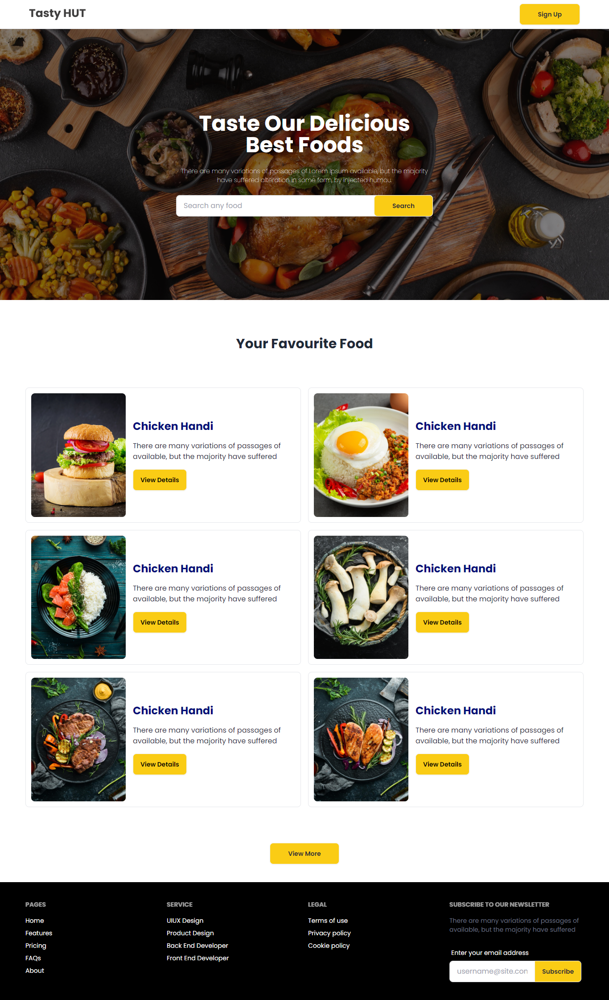

<h1 align="center">🍽️ Testy Hut 🍽️</h1>
<h3 align="center">Responsive Html Template</h3>

Testy Hut is a responsive HTML template designed for restaurants, cafes, and food-related businesses. Featuring a modern and clean layout, this template is perfect for showcasing delicious dishes, customer reviews, and menu highlights. Built with a mobile-first approach, Testy Hut ensures a seamless user experience across all devices.

## Project Live Link:

 <a href="https://rehan606.github.io/Testy-Hut-Html-Template/" >Click Here to Visit Live Project</a> 

## APIs For Dynamic

1. **Fetch All Meals by First Letter**

- **Endpoint:** https://www.themealdb.com/api/json/v1/1/search.php?f=a

- **Description:** Retrieves a list of all available meals by first letter. Show these meals in "Your Favorite Foods" section.

2. **Fetch Meal Details by ID**

- **Endpoint:** https://www.themealdb.com/api/json/v1/1/lookup.php?i=52772

- **Description:** Fetches detailed information for a specific meal based on its ID. This can be used to view additional information about the meal such as area, instructions, youtube.

3. **Fetch Meal Categories**

- **Endpoint:** https://www.themealdb.com/api/json/v1/1/categories.php

- **Description:** Fetches a list of meal categories. The id, name, image and description of the meals are included in the API.

4. **Fetch Meals by Category**

- **Endpoint:** https://www.themealdb.com/api/json/v1/1/filter.php?c=Seafood

- **Description:** When clicked on a certain category display a list of foods of that category.

## Project Layout:

## Features:
<ol>
    <li>Fully responsive design</li>
    <li>Clean and modern layout</li>
    <li>Easy-to-navigate menu sections</li>
    <li>Perfect for restaurants, cafes, and food businesses</li>
    <li>Cross-browser compatibility</li>
</ol>

## Technology Used:

<ol>
    <li>HTML</li>
    <li>TAILWIND CSS</li>
    <li>DAISY UI</li>
</ol>

